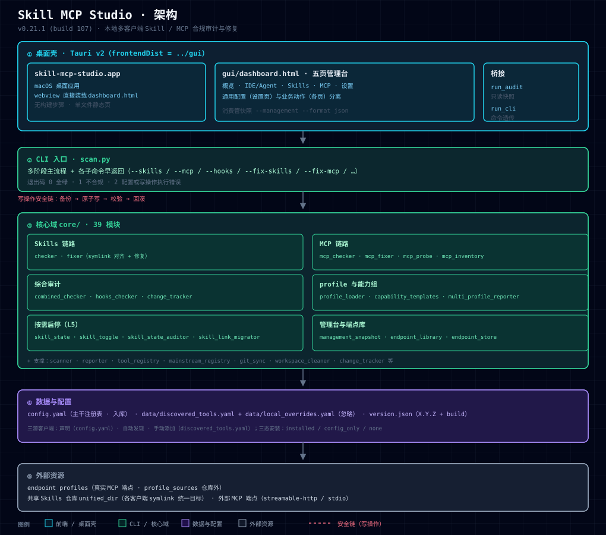
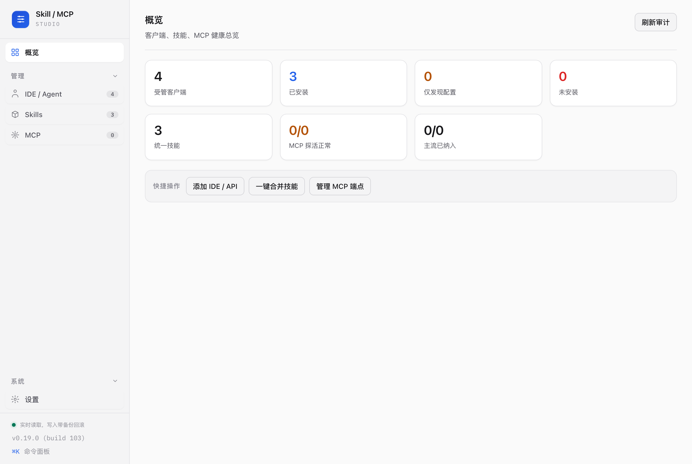

# Skill MCP Studio

<p align="center">
  
  
  
  
  
  
</p>

**Skill MCP Studio** 是一套本地多客户端 **Skill / MCP 合规审计与修复工具**，由一个
Python 审计 CLI、一个纯前端五页管理台（Tauri 桌面壳）和近 40 个领域模块组成。

它回答三类问题：

1. **IDE / Agent** → 本机装了哪些客户端（声明 + 自动发现 + 手动三来源），配置是否
   正确（App / CLI / 配置文件三态证据）；
2. **Skills** → 统一目录里有哪些技能，各客户端的 Skills 目录是「统一目录」还是
   独立目录，能否**一键合并**（对齐到共享仓库 symlink）；
3. **MCP** → 本机有哪些 MCP（手动指定 + 自动识别），各客户端挂了哪些，支不支持
   多 endpoint（端点库 + 每客户端多挂载 + 逐端点探活与能力验证）。

每条判断独立报告，互不混为一谈：

> **MCP 配置 ≠ 连通性 ≠ 生命周期 hooks ≠ 技能启停一致性**。

---

## 特性一览

- **三源客户端**：`config.yaml` 声明 · 自动发现 · 手动添加（`discovered_tools.yaml`）。
- **三态安装判定**：`installed`（有 App/CLI）/ `config_only`（仅配置）/ `none`（幽灵
  条目自动过滤，不进管理/审计）。
- **统一 Skills 仓库**：`unified_skills_dir` 聚合所有技能，逐客户端对齐 symlink，
  一键合并带 dry-run 预览、备份、原子写、校验、回滚。
- **endpoint profile 抽象**：端点库 CRUD + 每客户端多挂载 + 逐端点活体探活
  （`initialize` + `tools/list` + 能力组验证），个人真实端点隔离在仓库外。
- **按需加载与启停（L5）**：每「客户端 × 技能」三态启停矩阵、漂移审计、回滚幂等。
- **一致性 gate**：GUI 结论与 CLI 结论可脚本化交叉验证。

---

## 架构



```
scan.py                  CLI 入口（多阶段主流程 + 各子命令早返回）
├── core/                Python 领域逻辑（39 模块）
│   ├── checker/fixer          Skills 检查与修复（symlink 对齐）
│   ├── mcp_checker/mcp_fixer/mcp_probe   MCP 配置检查、修复、活体探测
│   ├── combined_checker       每客户端综合审计（Skills + MCP + hooks）
│   ├── profile_loader         endpoint profile 加载与三来源合并
│   ├── management_snapshot     管理台快照（IDE/Skills/MCP 三面板）
│   ├── endpoint_library/store  端点库 CRUD 与持久化
│   ├── skill_state/toggle/auditor/migrator   启停三态 + 迁移
│   └── ...                     scanner/reporter/change_tracker/git_sync 等
├── gui/dashboard.html   五页管理台（单文件静态页，webview 直接装载）
└── src-tauri/           Tauri v2 桌面壳（frontendDist=../gui，cargo tauri build → .app）
```

无构建步骤前端 `gui/dashboard.html` 通过 `run_audit`（只读快照）与 `run_cli`（管理/写
命令透传）两个桥接函数消费 CLI；通用配置（统一目录、端点库）与业务动作分离，通用层在
「设置」页、业务层在对应管理页。写操作统一走「备份 → 原子写 → 校验 → 回滚」安全链。

### 仓库结构

```
skill-mcp-studio/
├── scan.py                    CLI 入口（多阶段主流程 + 各子命令早返回）
├── core/                      Python 领域逻辑（39 模块）
├── gui/                       五页管理台前端（单文件 dashboard.html）
├── src-tauri/                 Tauri v2 桌面壳（cargo tauri build → .app）
├── scripts/                   构建 / 校验 / 网关辅助脚本
├── tests/                     单元测试（unittest，共 34 个文件）
├── docs/                      产品 / 设计 / 决策 / 评审文档（分类归档）
│   ├── product/               产品需求 · 定位 · 形态
│   ├── design/                阶段一~五设计 · 跨平台矩阵
│   ├── decisions/             决策记录 · 立项评估
│   └── reviews/               评审报告
├── config.yaml                主干注册表（tools / mcp_tools / profiles 占位）
├── version.json               版本号与构建号
├── README.md / LICENSE / CONTRIBUTING.md / CHANGELOG.md / SECURITY.md
└── pyproject.toml / setup.py  打包配置（pipx install .）
```

---

## 安装（单命令）

```bash
pipx install .
# 或从源码直接运行（无需安装）
pipx run --spec . skill-mcp-studio --version 2>/dev/null || python3 scan.py --help
```

> 依赖仅 `PyYAML`。安装后得到控制台命令 `skill-mcp-studio`（等价于 `python3 scan.py`）。

---

## 快速开始

### 1. 最小配置 `config.yaml`

```yaml
schema_version: 1
active_profile: my-mcp
profile_sources: []
profiles:
  my-mcp:
    name: my-mcp
    url: https://example.internal/mcp
    transport: streamable-http
    url_policy: strict
    required_capabilities: {}   # 空 = 只验证 initialize + tools/list
```

`mcp_tools` / `tools` / `auto_discover` 是客户端侧注册表，可先留空或按需补充。

### 2. 查看可用 profile 并选定

```bash
skill-mcp-studio --list-profiles
skill-mcp-studio --profile my-mcp --skills --mcp --hooks
```

### 3. 首次只读审计（活体探测 + 报告）

```bash
skill-mcp-studio --profile my-mcp --skills --mcp --hooks --probe-mcp --report
```

无参数执行是 **只读** 的；`--full` = 全部只读检查 + 报告，**绝不隐含** git pull /
cleanup / commit / push / 修复。

---

## 常用命令速查

**只读审计**

```text
--skills / --mcp / --hooks     分项只读检查
--probe-mcp                    执行 MCP initialize + tools/list
--full                         全部只读检查 + 端点探测 + 报告
--scan-only                    仅基础扫描 + 路径验证 + 变更追踪
```

**修复（写操作，均支持 --dry-run）**

```text
--fix-skills       修复 Skills 路径 —— 各客户端目录统一对齐 symlink（带备份回滚）
--fix-mcp          写入统一 Hermes MCP 配置（带备份）
--setup-all        一键设置并检查所有已安装 IDE/Agent 的 Skills + 统一 MCP
--remove-legacy-mcp  备份并移除旧 Hermes/ai-memory MCP 条目
--set-unified-dir PATH   写入 unified_skills_dir
```

**endpoint profile 与能力组**

```text
--profile NAME / --list-profiles
--all-profiles --format csv|json|md|table   跨 profile 汇总
```

**按需加载与启停（L5）**

```text
--list-skill-states [--client C]      只读：各客户端技能启停矩阵
--audit-skill-states                  只读：跨客户端启停一致性审计
--enable-skill SKILL [--client C]     启用某技能
--disable-skill SKILL [--client C]    禁用某技能
--migrate-skill-links [--client C]    root 形态 → 逐技能 symlink 迁移
--strict-skill-state                  把启停一致性纳入 result_ok
```

**端点库 / 管理台（阶段五）**

```text
--list-endpoints / --add-endpoint KEY / --remove-endpoint KEY / --update-endpoint KEY
--test-endpoint KEY                 探测某端点（initialize + tools/list）
--attach-endpoints KEY,... --client C   设置客户端 mcp_attach
--list-mcp-inventory                逐客户端 MCP 条目分类（attached/legacy/unmanaged）
--remove-mcp-entry KEY[,KEY...] --client C   删除指定 MCP 条目（含未纳管；高风险需 --force-high-risk）
--remove-mcp-class attached|legacy|unmanaged --client C   按分类批量清理（默认跳过高风险，需 --include-high-risk 才纳入）
--list-config-backups --client C    只读列出该客户端配置的历史备份（<配置文件名>.bak-<时间戳>）
--restore-config-backup PATH --client C   用指定备份还原该客户端配置（整文件覆盖，还原前自动再备份当前）
--management --format json          管理台管理快照（GUI 数据源）
--version                           输出版本 JSON
```

以上 6 个新参数（`--remove-mcp-entry` / `--remove-mcp-class` / `--force-high-risk` /
`--include-high-risk` / `--list-config-backups` / `--restore-config-backup`）：

- **`--client` 要求**：全部需要配合 `--client <客户端名>`，缺失即报错退出（码 2）。
  `--force-high-risk` / `--include-high-risk` 是修饰 flag，不单独使用。
- **`--dry-run` 支持**：`--remove-mcp-entry` / `--remove-mcp-class` /
  `--restore-config-backup` 均支持 `--dry-run`（只算不写）；
  `--list-config-backups` 本身只读。
- **`--format json` 支持**：全部支持，stdout 为纯 JSON 结构
  （`status` / `message` / `path` / `backup` / `removed` / `skipped_high_risk` /
  `attach_updated`），GUI 据此判定结果而非做字符串匹配。
- **高风险门**：疑似客户端自带（命令落在该客户端 app bundle 内、或条目名与客户端同名）
  的条目默认**拒绝删除**并返回 `status=refused`、退出码 `2`；确需删除必须显式加
  `--force-high-risk`（单条）或 `--include-high-risk`（批量）。
- **回滚**：写操作都先落一份 `<配置文件名>.bak-<时间戳>` 备份；
  还原是**整文件覆盖**（该配置文件的全部后续改动都会回退，不只是 MCP 段落）。
- **删除 `attached` 条目会同步摘除挂载声明**；若摘除后声明将变空则整体拒绝
  （本项目语义中「空声明」==「挂载全部端点」）。

**客户端发现与生命周期**

```text
--add-client NAME --client-skills-path P [--client-type T]   手动添加客户端
--add-defaults                     一键默认添加所有主流 IDE/Agent
--remove-client NAME               移除客户端（停用 + 条目 + 残留 + 链接）
--cleanup-config [--client C]      清理 config_only 残留配置文件
--discover                         启用自动发现新工具
```

**skill 级文件操作（均支持 --dry-run）**

```text
--backup-skill SKILL / --export-skill SKILL
--rename-skill SKILL --new-name N --new-description D
--delete-skill SKILL   软删除（先备份再移入 _trash/）
```

**其它**

```text
--report          生成 Markdown 报告 scan-report.md
--sync / --analyze / --clean / --push / --update
--config PATH / --unified-dir PATH / --dry-run / --no-interactive
```

退出码：`0` 全绿；`1` 存在不合规项；`2` 配置 / profile / 模板加载或**写操作执行**错误。

---

## 一键合并

「一键合并」把各客户端各自的 Skills 目录统一对齐到同一个共享技能仓库（软链
`symlink` 指向 `unified_dir`）。GUI 点击先弹 **dry-run 预览**（只读，绝不落盘）：

- **合并清单**只纳入「已安装 / 仅配置」的客户端，与 IDE/Agent 页口径一致，
  过滤掉无 App/CLI/配置的幽灵条目；
- 「当前状态」列标出每台客户端现状（正确 / 缺失 / 真实目录 / 错误指向 / 断链 /
  跳过），「合并后」列给出动作（保持不动 / 创建·改为 symlink / 重建 symlink）；
- 图例区说明各标记含义；清单每页 8 行、变更报告默认折叠，避免默认滚动条；
- 确认「实写」才走 `--fix-skills` 主流程。

对应 CLI：

```text
skill-mcp-studio --fix-skills --dry-run --format json   预览（结构化为表格）
skill-mcp-studio --fix-skills                          真实写入（备份回滚）
```

---

## 按需加载与启停（阶段四，L5）

在 L1–L4 之外新增第 5 层：每个「已安装客户端 × 仓库内技能」归一为
`enabled` / `disabled` / `not_in_repo` 三态（`not_in_repo` 不计入漂移）。

- **形态限制**：单技能启停仅支持「逐技能 symlink」（per_skill）形态；root 形态
  只整体审计，`--client` 强启停返回退出码 2（需先 `--migrate-skill-links`）。
- **安全模型**：写操作复用 `mcp_fixer` 的备份 → 原子写 → 写后校验 → 失败回滚；
  symlink 用 `os.symlink(temp)+os.replace` 原子替换，无删除窗口；审计通道严格只读。
- **数据契约**：`records` 只增字段（`skill_states` / `skills_enabled_count` /
  `skills_total` / `skill_link_form`）；结果层新增 `skill_state_drift`，`summary`
  新增 `skill_state_consistent`。
- **启停退出码**：`0` 全绿；`1` 写后校验失败（已回滚）；`2` 技能不在仓库 / 形态
  不支持 / 回滚失败。

---

## endpoint profile 与能力组模板

`required_capabilities` 可直接手写工具名，也可通过 `extends` 引用 `templates:` 里的
命名模板：

```yaml
templates:
  memory-basic:
    capabilities:
      memory: [memory_search, memory_add, memory_get]

profiles:
  my-mcp:
    name: my-mcp
    url: https://example.internal/mcp
    required_capabilities:
      extends: [memory-basic]
      custom_group: [extra_tool]   # 手写组覆盖同名模板组
```

模板三来源按「后装载覆盖同名」合并，优先级从低到高：

1. 内置：`config.yaml` 的 `templates:` 段；
2. 项目级：`<config 目录>/.skill-mcp-studio/templates/*.yaml`；
3. 用户级：`~/.config/skill-mcp-studio/templates/*.yaml`。

目录内任一文件无法解析时，加载期直接报错点名问题文件（退出码 2），不静默跳过。

### 本地 profile 覆盖（`profile_sources`）

主干 `config.yaml` 保持零个人拓扑：真实端点放仓库外文件，经 `profile_sources` 合并
（内联值先、各源按序覆盖，后者赢）。

```yaml
# config.yaml（受版本控制，只放通用占位）
profile_sources:
  - ~/.skills-manager/profiles.local.yaml
```

```yaml
# ~/.skills-manager/profiles.local.yaml（仓库外，不进版本库）
active_profile: hermes-home
profiles:
  hermes-home:
    name: hermes
    url: https://your-real-endpoint.example/mcp
    transport: streamable-http
    url_policy: strict
    required_capabilities: {}
```

源文件可携带 `profiles` / `templates` / `active_profile` 三类键；文件不存在时静默跳过，
损坏则按配置错误退出（2）。

### 未纳管豁免与按客户端 legacy 声明

- **`unmanaged_exempt`**（顶层，可选）：已知非技能消费客户端的归一化名单，审计不报
  UNMANAGED、不判不合规，但保留扫描可见性。
- **工具级 `legacy_names`**（`mcp_tools` 条目）：某客户端独有的遗留条目正典名（如
  OpenCode 的 stdio 桥名 `hermes` vs 正典 `hermes-unified`）。审计计入
  `legacy_channels`，`--remove-legacy-mcp` 负责清理；只读客户端不计入安全门门槛。

### 汇总 CSV 空值语义

`--all-profiles --format csv` 的能力组列是所有 profile 能力组的**并集**：

- `True` / `False`：该 profile **声明了**此能力组，且满足 / 未满足；
- 空串：该 profile **未要求**此能力组（消费方按 `N/A` 处理，非失败）；
- `legacy_channels` 空串：无遗留 MCP 通道。

---

## 管理台 GUI（阶段五）



`gui/dashboard.html` 是五页管理台（**概览 · IDE/Agent · Skills · MCP · 设置**），消费
管理快照（`--management --format json`）：

1. **概览**：KPI 汇总（受管客户端 / 安装 / 技能 / MCP 探活 / 主流纳入）+ 快捷操作；
2. **IDE / Agent**：各客户端安装状态、Skills 路径合规、挂载端点（含 MCP「N/M」图例）；
3. **Skills**：统一目录、技能清单、每客户端启用状态、一键合并（含预览与图例）；
4. **MCP**：每客户端挂载与条目分类（已挂载 / 旧通道 / 未纳管）+ 覆盖矩阵；
5. **设置**：通用配置（统一技能目录、MCP 端点库增删改、自动发现、关于）。

通用 / 业务分离：通用配置在「设置」页、业务动作在对应管理页。产品需求单一权威见
[`docs/product/PRD-产品需求文档.md`](docs/product/PRD-产品需求文档.md)。写操作经
`run_cli` 转发 CLI，沿用备份 → 原子写 → 校验 → 回滚
安全链；浏览器直开渲染内置示例（写按钮提示需桌面壳）。

- 端点库管理：`--list-endpoints` / `--add-endpoint` / `--remove-endpoint` /
  `--update-endpoint`（均支持 `--dry-run`）
- MCP 自动识别：`--list-mcp-inventory`
- 一致性 gate：`scripts/verify_gui_consistency.sh`（验证 GUI 结论 == CLI 结论）

Tauri 壳在 `src-tauri/`（`cargo tauri build` 产出 `.app`），构建步骤见
`src-tauri/BUILD.md`。

---

## 配置与数据文件

| 文件 | 是否入库 | 用途 |
| --- | --- | --- |
| `config.yaml` | ✅ 入库 | 主干注册表（tools / mcp_tools / profiles / 通用占位） |
| `version.json` | ✅ 入库 | 版本 `X.Y.Z` + `build` |
| `data/discovered_tools.yaml` | ❌ 忽略 | 手动添加 / 自动发现的客户端持久化 |
| `data/local_overrides.yaml` | ❌ 忽略 | 本机覆盖 |
| `~/.skills-manager/profiles.local.yaml` | ❌ 仓库外 | 个人真实端点（经 `profile_sources` 合并） |

---

## 开发

```bash
# 单元测试
python3 -m pytest tests/ -q

# 桌面 App 构建（macOS，本机架构）
cargo tauri build --target aarch64-apple-darwin

# 通用二进制（Intel + Apple Silicon 单 .app，Tauri 自动 lipo 合并）
rustup target add x86_64-apple-darwin
cargo tauri build --target universal-apple-darwin
```

### CI / 发布（GitHub Actions）

[`.github/workflows/build-macos.yml`](.github/workflows/build-macos.yml) 自动化构建与发布：

| 触发 | 行为 |
| --- | --- |
| push / PR 到 `master` | 构建 universal `.app` + `.dmg`，上传为 workflow artifact |
| 手动 `workflow_dispatch` | 同上 |
| push `v*` tag（如 `v0.23.0`） | 构建并**自动创建 GitHub Release**，上传 `.dmg` 与 `.app.zip` |

产物为**通用二进制（universal）**，原生运行于 Intel 与 Apple Silicon，无需 Rosetta。

**签名与公证（可选）**：未配置证书时自动回退 ad-hoc 签名（本机可运行，未公证，
分发他人需右键打开）。要启用正式签名 + 公证，在仓库 Settings → Secrets and
variables → Actions 配置以下 secrets：

| Secret | 说明 |
| --- | --- |
| `APPLE_CERTIFICATE` | `Developer ID Application` 证书导出 `.p12` 的 base64（`openssl base64 -A -in cert.p12`） |
| `APPLE_CERTIFICATE_PASSWORD` | 上述 `.p12` 的密码 |
| `APPLE_SIGNING_IDENTITY` | 签名身份（如 `Developer ID Application: Name (TEAMID)`） |
| `APPLE_ID` | Apple ID 邮箱（公证用） |
| `APPLE_PASSWORD` | App 专用密码（公证用，非 Apple ID 登录密码） |
| `APPLE_TEAM_ID` | 团队 ID（公证用） |

部署相关的 endpoint 细节（网络可达性、DNS、反代路由）属于各 profile 独立仓库
（`profile_sources`），不属于本工具本体。

### 文档

完整文档索引见 [`docs/README.md`](docs/README.md)，按层级分类：

| 层级 | 路径 | 说明 |
| --- | --- | --- |
| 产品 | [`docs/product/`](docs/product/) | PRD、产品定位与路线图、产品形态与开发计划 |
| 实现 | [`docs/design/`](docs/design/) | 阶段一~五设计文档、跨平台路径矩阵 |
| 决策 | [`docs/decisions/`](docs/decisions/) | 待决问题定案（D1–D16）、阶段四立项评估 |
| 评审 | [`docs/reviews/`](docs/reviews/) | 评审整改清单与评审报告 |

---

## 贡献

欢迎提交 Issue 与 Pull Request。开发环境准备、测试与提交规范见
[`CONTRIBUTING.md`](CONTRIBUTING.md)。安全漏洞请按 [`SECURITY.md`](SECURITY.md)
的流程非公开上报。

## 许可

[MIT](LICENSE) © 2026 oswaldhill

## 变更

历史变更见 [`CHANGELOG.md`](CHANGELOG.md)。